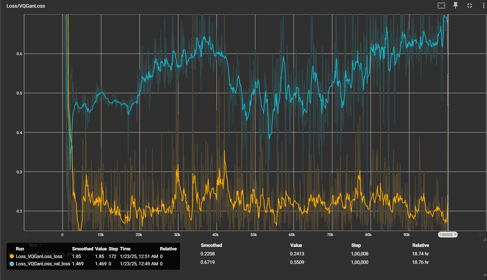
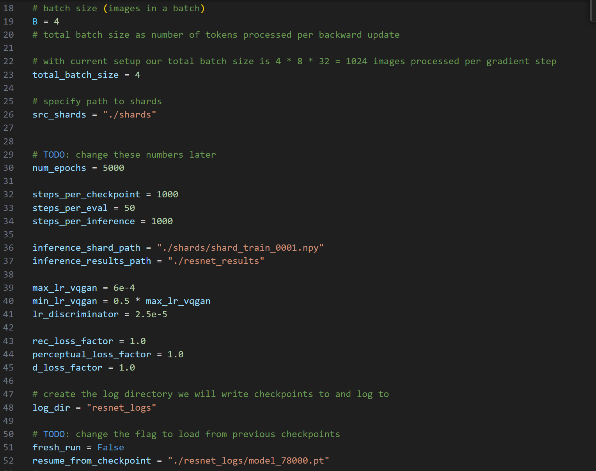

# Image synthesis using VQGAN
###### Special thanks to master Andrej Karpathy for being an amazing teacher/knowledge transfer person.
# Model Specifications:
- VQGAN : 108M parameters
- GPT Transformer model for autoregressive generations : 91.5M parameters

## VQGAN: Discrete Neural Representation Learning Model for Generative Downstream Tasks
- Vector Quantized Generative Adversarial Networks (**VQGAN**s) is a generative model architecture that utilises Vector Quantized Variational Auto Encoder (**VQVAE**) which learns how to represent images in a lower dimensional latent space in an **autoencoder** like fashion, discretize the latent space representation of images using a codebook (hence the vector quantized part) and finally how to reconstruct the original image using this quantized latent representation. The optimization objective for reconstruction could be either L2 or L1 losses between reconstruction and original image in pixel space.
- The encoder and decoder used in the VQVAE architecture are fully convolutional, which are responsible for translating the image into latent space, quantizing the continuous latent representation and reconstructing from the quantized latent representation respectively.
- The architecture runs **self-attention** in the bottleneck of the encoder in the latent space for learning a better representation of global context within the image itself, which could be less stressed on by the convolutional layers in the encoder.
- The neural representation learning task is further guided by Perceptual Loss component from a pretrained **Learned Perceptual Image Patch Similarity model** and Adversarial Loss component from a **Patch Discriminator**, which incentivizes the model to minimize abstract divergence between reconstructions and original images in latent space and ensures that outputs are better aligned with realistic image distribution respectively.
- Both encoder and decoder are designed upon slight variation of convolutional **Res-Net** block architecture.
- The quantization operation is reparametrized so that gradients can flow back into the encoder from supervision.

- The overall objective for finding optimal neural representation model:


- The architecture was introduced in [Taming Transformers for High-Resolution Image Synthesis](https://arxiv.org/abs/2012.09841)


### Results for first stage (Reconstruction):
#### Epoch 1:

#### Epoch 50:


#### Stage 1 Training Graph
###### VQGAN Loss:

###### Discriminator Loss:


### Results for second stage (Generation):
#### Blind Generations (Only start token as initial context to the transformer):

#### Generated Samples : Context Completion (Top half of image as initial context to the transformer):


###### GPT autoregressive modeling Loss:


## Notes for training VQGAN on your own data:
### Stage one (training VQGAN for discrete neural representation learning)
- Shardify your dataset into train and validation shard using the script shardify.py, make sure to specify source path of images, dest path of shards and number of images per shard in the said script as arguments to the following function:

- Configure the training hyperparameters in train_resnet_vqgan.py, specify the source path to shards, logging directory (for model checkpoints and loss logs), path where you want the inferences to be saved etc

- Run the training script as follows:
```bash
      torchrun --standalone --nproc_per_node=1 train_resnet_vqgan.py
```
- To resume training from a specific checkpoint, set the fresh_run flag to false and specify path of the checkpoint from which training is to be resumed

- vqgan_inference_play.ipynb has a demo on how to perform inference. Note that images do have to be shardified using shardify.py and then fed into the model as evident from the demo notebook.

### Stage two (training GPT for autoregressively generating images from learned codebook prior)
- After having trained the VQGAN, use image_quantizer.py to create shards of images represented in latent space by collection of indices of codebook vectors.
- Configure the training hyperparameters in train_resnet_vqgan.py, specify the source path to shardifiedLatentIndices, logging directory (for model checkpoints and loss logs), path where you want the inferences to be saved, path to pretrained vqgan checkpoint etc

- Run the training script as follows:
```bash
      torchrun --standalone --nproc_per_node=1 train_gpt.py
```
- To resume training from a specific checkpoint, set the fresh_run flag to false and specify path of the checkpoint from which training is to be resumed
- gpt_inference_play.ipynb has a demo on how to perform inference. Note that images do have to be shardified using shardify.py and image_quantizer.py and then fed into the model as evident from the demo notebook.
- The training scripts for both the stages ensure that model checkpoints are saved periodically, specified by "steps_per_checkpoint" in train_resnet_vqgan.py and train_gpt.py. The checkpoints are stored in the specified log_dir.

## Citation
```bibtex
@misc{esser2021taming,
      title={Taming Transformers for High-Resolution Image Synthesis}, 
      author={Patrick Esser and Robin Rombach and Björn Ommer},
      year={2021},
      eprint={2012.09841},
      archivePrefix={arXiv},
      primaryClass={cs.CV}
}
```
